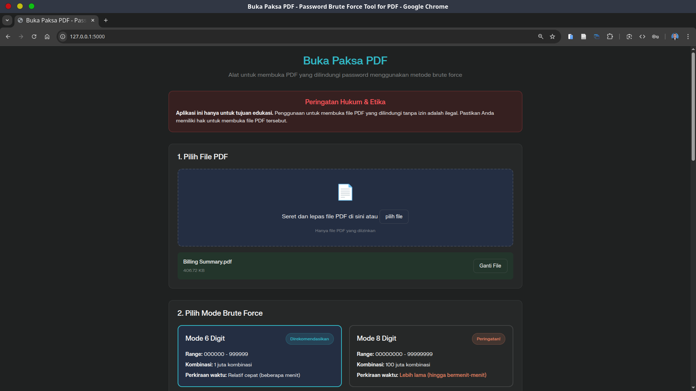

# 🔓 Pembuka Password PDF & Penampil PDF

Aplikasi ini membantu Anda membuka file PDF yang terkunci password dengan metode brute force (coba semua kombinasi angka 6 atau 8 digit), serta dilengkapi penampil PDF yang lengkap dan mudah digunakan.

> [!IMPORTANT] 
> Aplikasi ini hanya untuk pembelajaran. Membuka file PDF yang dilindungi tanpa izin adalah tindakan ilegal.

> [!WARNING] 
> Pastikan Anda memang berhak membuka file PDF tersebut. Gunakan aplikasi ini hanya untuk file milik Anda atau yang Anda punya izin untuk membukanya.

> [!CAUTION]  
> Pengembang tidak bertanggung jawab atas penyalahgunaan aplikasi ini.

---

Tampilan Web UI menggunakan `Flask` yang modern dan responsif, serta algoritma brute force yang dioptimalkan dengan multi-threading untuk memaksimalkan penggunaan CPU.


Tampilan GUI menggunakan `tkinter` yang ringan dan responsif, serta algoritma brute force yang dioptimalkan dengan multi-threading untuk memaksimalkan penggunaan CPU.


---

## ✨ Fitur Utama

### 🔐 **Pembuka Password PDF:**

- ✅ **Mode 6 digit** (000000-999999) - Cepat
- ✅ **Mode 8 digit** (00000000-99999999) - Lengkap, lebih lama
- ⚡ **Multi-threading** - Memaksimalkan semua inti CPU
- 🧵 **Single-thread** - Alternatif stabil, progress detail
- 📊 **Progress real-time** dengan estimasi waktu sisa
- ⏸️ **Jeda/Lanjutkan** - Konfirmasi sebelum lanjut
- ⏹️ **Stop kapan saja** - Proses bisa dihentikan aman

### 📖 **Penampil PDF Lengkap:**

- 🖼️ **Bisa buka banyak halaman**
- 🔍 **Zoom canggih** (0.25x - 5.0x)
- 🧭 **Navigasi halaman** - Sebelumnya, Berikutnya, Lompat, Awal, Akhir
- ⌨️ **Shortcut keyboard** - Navigasi & zoom cepat
- 📏 **Auto-fit window** - Ukuran otomatis
- 🖱️ **Scroll** - Mendukung scroll vertikal & horizontal

### 💻 **Pengalaman Pengguna:**

- 🎨 **Tampilan profesional** dan rapi
- 💬 **Dialog custom** dengan font besar & tombol jelas
- 📱 **Desain responsif** - Menyesuaikan ukuran window
- 🔄 **Aman untuk thread** - GUI tetap responsif
- ℹ️ **Feedback real-time** untuk semua proses

## 🚀 Cara Cepat Memulai

### **Syarat:**

- Python 3.7+ =====> [Cara Install Python di Windows, Linux dan MacOS](https://www.codepolitan.com/blog/cara-install-python-di-windows-macos-dan-linux-lengkap/)
- Dependensi: `PyMuPDF`, `Pillow`, `tkinter`

### **Instalasi:**

```bash
git clone https://github.com/alrescha79-cmd/buka-paksa-pdf.git pdf-viewer
```

```bash
cd pdf-viewer
```

```bash
pip install -r requirements.txt
```

### **Menjalankan Aplikasi:**

1. Menggunakan Web UI (Flask):

    ```bash
    flask run
    ```

    atau

    ```bash
    python app.py
    ```

2. Menggunakan GUI (tkinter):

    Jalankan langsung

    ```bash
    python main.py
    ```

    Atau pakai launcher

    ```bash
    python launcher.py
    ```

## 📋 Cara Penggunaan

### **1. Pilih PDF & Mode**

- Klik **"Pilih PDF dan Mulai"**
- Pilih mode **6 digit** (cepat) atau **8 digit** (lengkap)
- Pilih **Multithreading** (disarankan) atau **Single-thread**

### **2. Pantau Progress**

- **Progress real-time** dengan estimasi waktu sisa
- **Indikator kecepatan** (percobaan/detik)
- **Jeda/Lanjutkan** dengan konfirmasi
- **Tombol Stop** untuk menghentikan proses

### **3. Buka PDF**

Setelah password ditemukan, PDF akan terbuka dengan fitur penampil lengkap:

#### **🔍 Kontrol Zoom:**

- Tombol **Zoom In/Out** atau tombol `+`/`-`
- Tombol **Fit Window** atau `0`/`F`
- **Scroll mouse** untuk zoom cepat

#### **🧭 Navigasi Halaman:**

- Tombol **Sebelumnya/Berikutnya** atau panah keyboard
- Dialog **Lompat ke halaman** atau tombol `G`
- Tombol **Awal/Akhir** untuk halaman pertama/terakhir
- Indikator halaman saat ini

#### **⌨️ Shortcut Keyboard:**

```
Navigasi:  ← → ↑ ↓ P N      (Halaman sebelumnya/berikutnya)
           Home End         (Halaman pertama/terakhir)
           G                (Dialog lompat halaman)

Zoom:      + - = 0 F        (Zoom In/Out/Fit)
```

## ⚡ Fitur Lanjutan

### **🎮 Sistem Jeda/Lanjutkan:**

- **Jeda pintar** dengan konfirmasi sebelum lanjut
- **Manajemen resource** - hemat CPU saat dijeda
- **Waktu akurat** - waktu jeda tidak dihitung estimasi
- **Lanjutkan mulus** dari posisi terakhir

### **📊 Monitoring Progress:**

- **Progress real-time** dengan visual bar
- **Indikator kecepatan** (percobaan/detik)
- **Estimasi waktu** berdasarkan kecepatan saat ini
- **Monitoring CPU** untuk performa optimal

## ⚠️ Catatan Penting

### **Performa:**

- **Mode 6 digit:** Menit hingga jam (1 juta kombinasi)
- **Mode 8 digit:** Jam hingga hari (100 juta kombinasi)
- **Multi-threading:** Hingga 10x lebih cepat dari single-thread
- **Performa tergantung kecepatan CPU dan posisi password**

### **Legalitas:**

> Gunakan hanya untuk file PDF milik Anda atau yang Anda punya izin membukanya.

## 🛠️ Solusi Masalah

### **Masalah Instalasi:**

```bash
# Install dependensi
pip install -r requirements.txt

# Linux: Install tkinter jika belum ada
sudo apt-get install python3-tk  # Ubuntu/Debian
sudo dnf install python3-tkinter # Fedora
```

### **Masalah Saat Menjalankan:**

- **PDF tidak bisa dibuka:** Cek izin file dan validitas
- **Lambat:** Tutup aplikasi lain, gunakan multi-threading
- **Masalah memori:** Gunakan mode 6 digit untuk RAM terbatas

## 🏗️ Spesifikasi Teknis

| Komponen         | Teknologi         | Fungsi                       |
|------------------|------------------|------------------------------|
| **Arsitektur**   | Python Modular   | Pemisahan logika & tampilan  |
| **Framework GUI**| tkinter          | Antarmuka lintas platform    |
| **PDF**          | PyMuPDF (fitz)   | Baca & otentikasi PDF        |
| **Rendering**    | Pillow (PIL)     | Tampilkan halaman PDF        |
| **Threading**    | concurrent.futures| Paralel brute force password |
| **Range Password**| Angka brute force| 6 digit: 1 juta, 8 digit: 100 juta |

---

## Kontribusi

Anda dipersilakan untuk berkontribusi pada proyek ini. Berikut beberapa cara Anda bisa membantu:

- **Laporkan Bug:** Jika Anda menemukan bug atau masalah, silakan laporkan di bagian "Issues" di GitHub.
- **Ajukan Fitur Baru:** Punya ide untuk fitur baru? Ajukan di bagian "Issues" atau buat pull request.
- **Perbaiki Dokumentasi:** Bantulah memperbaiki dokumentasi agar lebih jelas dan lengkap.
- **Kode:** Jika Anda seorang pengembang, Anda bisa membantu dengan mengirimkan pull request untuk memperbaiki bug atau menambahkan fitur baru. memperbaiki dokumentasi agar lebih jelas dan lengkap.

---
